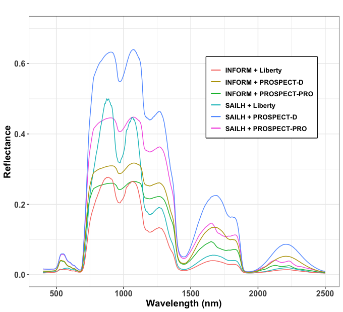
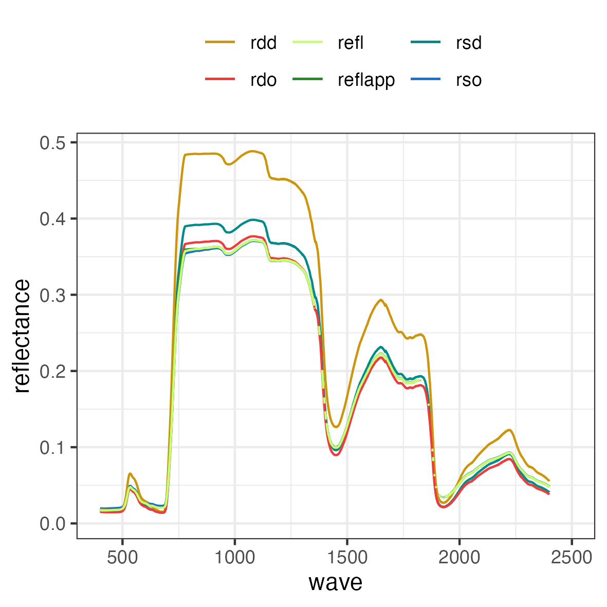
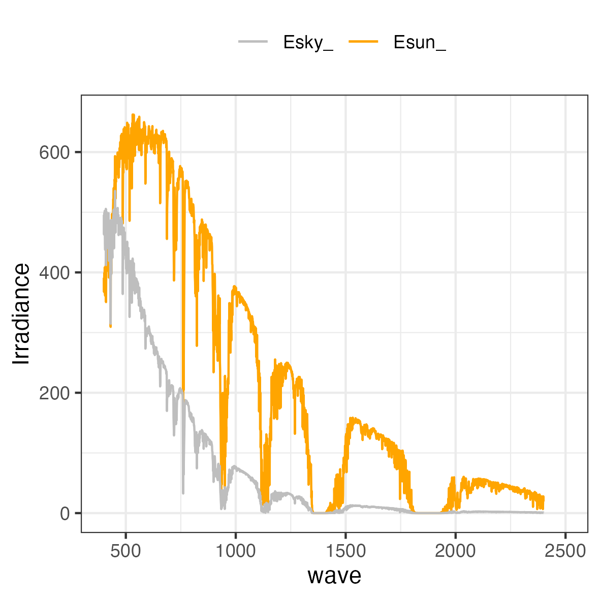
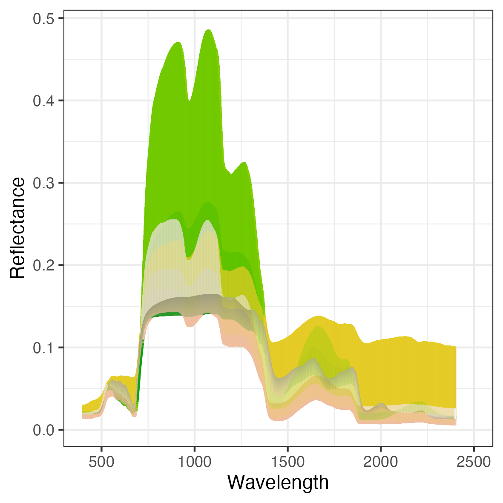
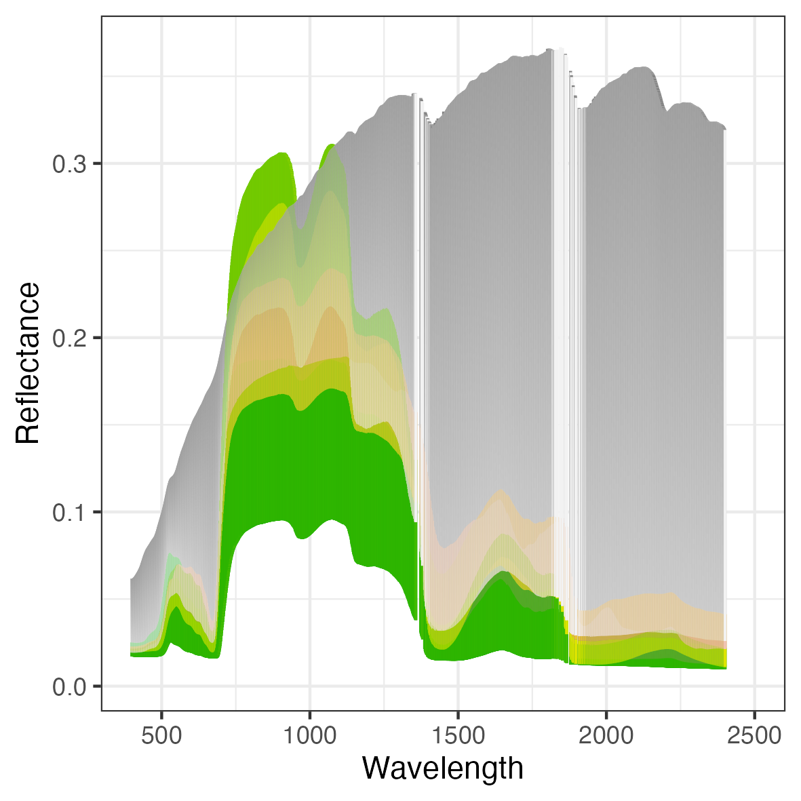

# 1. ToolsRTM Simulator app

The ToolsRTM Simulator stands as a user-friendly interface within a Shiny app, facilitating the simulation of canopy reflectance at both Top of Canopy (TOC) and Top of Atmosphere (TOA) levels within diverse ecosystems, encompassing forests and crops.

{width="546"}

**Fig. 1** Simulation using several biophysical models.

The ToolsRTM Simulator app has dependencies on two key R packages to ensure its functionality: To effortlessly simulate and utilize the function in the server, you can achieve this seamlessly by employing two primary R packages:

1.  **ToolsRTM Package:** The ToolsRTM package is an integral R package that consolidates key radiative transfer (RT) models for simulating canopy reflectance across hyperspectral and Sentinel-2 scales. This versatile package incorporates various functions for estimating plant traits, calculating spectral indices, and providing useful tools for generating time series. Additionally, it facilitates the validation of predictions through comparison with field observations.

2.  **SCOPEin Package:** The SCOPEin R package is designed to execute the Soil Canopy Observation, Photochemistry, and Energy fluxes (SCOPE) radiative transfer model. Originally developed in MATLAB by Van der Tol et al. (2009) and extended by Yang et al. (2020), SCOPEin R enables seamless integration of the SCOPE model within the R environment, offering users the flexibility to harness its capabilities for in-depth analysis.

The online RT-platform and R packages are available under GNU license. The online RT-simulator is currently accessible at <https://carlos-camino.shinyapps.io/0-toolsrtm-simulator/>

**Citation**: Camino et al. (2024): **DOI:** [10.1109/IGARSS53475.2024.10642442](https://doi.org/10.1109/IGARSS53475.2024.10642442)

# 2. ToolsRTM package

An R package equipped with a suite of tools designed for simulating canopy reflectance using an array of radiative transfer (RT) models at diverse satellite resolutions. Notable models include INFORM, fourSAIL, FourSAIL2 for canopy-scale simulations, and PROPSECT (D and PRO), Liberty, and Fluspect (D-Cx) for leaf-level simulations. This comprehensive package empowers users to perform detailed simulations across different scales and models, allowing for versatile and accurate analyses of canopy reflectance characteristics.

## 2.1. Getting started

To install the ToolsRTM package, please follow these instructions in R session:

1)  Download the ToolsRTM package as .tar.gz file

```         
## install ToolsRTM

install.packages('pathWithFile/toolsrtm-main.tar.gz',repos = NULL,type = "source")
```

## 2.2. Simulating at TOA refectance using SPART model

```         
inputs.SPART = simRTM::inputsRTMs

LUT<-data.frame(simRTM::getLUT(inputs = inputs.SPART, nLUT=1, setseed = 1234))
head(inputs.SPART)
sim.spart <-  simRTM::SPART(inputLUT=LUT[1,], optipar=SCOPEinR::optipar2021.Pro.CX,
                    CanopyModel = 'fourSAIL',
                    LeafModel='PROSPECT-D',
                    df.irradiance = NULL,
                    sensor.i = simRTM::Sentinel2A.MSI,get.plots=T)
```

## 2.3. Simulating at TOC refectance copling fourSAIL + Liberty models

```         
inputs.liberty = simRTM::inputsLiberty
LUT<-as.data.frame(simRTM::getLUT_liberty(inputs = inputs.liberty, nLUT=nSamples, setseed = 1234))
head(LUT)

sim.liberty<-simRTM::liberty(inputLUT = LUT[1,])


sim.prosail.liberty<-simRTM::foursail(inputLUT=LUT[1,],rsoil=rsoil0[[1]],LeafModel = 'Liberty')
rdot<-sim.prosail.liberty[[1]]
rsot<-sim.prosail.liberty[[2]]
rfl.prosail.liberty<-simRTM::Compute_BRF(rdot=rdot,rsot=rsot,tts=LUT[1,'tts'],data.light=simRTM::dataSpec_PDB)
plot(rfl.prosail.liberty)

df.rfl <- data.frame(wave =c(400:2500), rfl.toc = rfl.prosail.liberty,rdot = rdot)

plot.Liberty <- ggplot(data = df.rfl, aes(x = wave)) +
  labs(y= " reflectance", x = "") +
  geom_line(aes(y = rfl.toc, color = "rfl toc")) +
  geom_line(aes(y = rdot, color = "rdot")) + theme_bw() +
  guides(color = guide_legend(title = "reflectance"), linetype = guide_legend(title = "reflectance"), shape = guide_legend(title = "reflectance"))

print(plot.Liberty)
```

## 2.4. Get TIFF images from a NetCDF

```         
path_netCDF<-paste('NetCDF',sep='')

parcels<-c('A','B')

pattern_= 'gee_SE'
for (i in (1:length(parcels))){
  print(i)

  output.tiffs<-paste('NetCDF/TIFF/',parcels[i],'/',sep='')
  ifelse(!dir.exists(output.tiffs), dir.create(output.tiffs), FALSE)

  ToolsRTM::getTIFFs_GEE(netCDFs = path_netCDF,bands = SE_20m, output=output.tiffs, pattern = pattern_)
  daily.files<-paste(output.tiffs,'daily/',sep='')

  ToolsRTM::getStacks(rasterFiles = daily.files,bands = SE_20m, output=output.tiffs)
}
```

## 2.5. Extract series from Stack files

```         
## Read shapefile
require(sf)
shape <- sf::read_sf(dsn = paste('Shapefiles/Villasabariego/Ptos/Villasabariego_points.shp',sep = ''))

shape.prj <-st_transform(shape,32629)
plot(shape.prj)

## convert to Spatial Dataframe
shape.prj = as(shape.prj, "Spatial")
# Factor for reflectance
factorR = 1/10000

# output folder to save table with inputs
paths.outs='Tables/SEdata/'
ifelse(!dir.exists(paths.outs), dir.create(paths.outs), FALSE)

#inputs
paths.se2a='NetCDF/TIFF/Sabariego/Stacks/'
data.serie<-getSeries(pathRaster=paths.se2a, shapefile=shape.prj, band_names=SE_20m,factorR=factor)

file.to.export<-paste(paths.outs,'TimeSerie_SE2a_Sabariego.csv',sep='')
write.table(data.serie, file = file.to.export, sep=",", row.names = FALSE, col.names = T,append = F)
```

## 2.6. Get Simulation with a fixed conditions of chlorophyll content.

> ToolsRTM::getSim_fromLUT(trait = 'Cab',nmin = 10,nmax=90,Interval = 10,model = 'PROSAIL', method='ggplot')


**Fig. 2** Chlorophyll content variations using PROSAIL model (PROSPECT-PRO + fourSAILH).

## 2.7. Create a LUT for simulating a RT model using ToolsRTM package

```         
inputs.fluspect = simRTM::inputsFlUSPECT
LUT<-as.data.frame(simRTM::getLUT(inputs = inputs.fluspect, nLUT=nSamples, setseed = 1234))
```

## 2.8. Predict chlrorophyll content using ToolsRTM

```         
### Selected the most appropiated bands for predicting Chlorophyll content

selected.bands<-c('B2','B3','B4','B5','B6','B7','B8')
deepML <-c('Hidden-layers','CNN') ### options: 'CNN','Hidden-layers'

ToolsRTM::getMLmodel.withRetrain(dataset=LUT[c('Cab',selected.bands)], depVar=''Cab',model=deepML[1],optimizer='adam',n.times=3,batch.size=32, n.epochs=200, prop.split=c(0.8,0.2),   data.trans='preProcess',method.preProcess='Normalize')
```

## 2.9. Citation

If you use ToolSRTM, please cite the following references:

### 2.9.1. PROSPECT model

Authors:Jean-Baptiste FERET ([jb.feret\@teledetection.fr](mailto:jb.feret@teledetection.fr){.email}); Frédéric BARET ([baret\@avignon.inra.fr](mailto:baret@avignon.inra.fr){.email}); Stephane JACQUEMOUD ([jacquemoud\@ipgp.fr](mailto:jacquemoud@ipgp.fr){.email})

Féret J-B, Gitelson AA, Noble SD & Jacquemoud S, 2017. PROSPECT-D: Towards modeling leaf optical properties through a complete lifecycle. Remote Sensing of Environment, 193, 204--215. <https://doi.org/10.1016/j.rse.2017.03.004>

Féret, J.B., Berger, K., de Boissieu, F., Malenovský, Z., 2021. PROSPECT-PRO for estimating content of nitrogen-containing leaf proteins and other carbon-based constituents. Remote Sens. Environ. 252. <https://doi.org/10.1016/j.rse.2020.112173>

Jacquemoud S, Baret F, Hanocq J-F, 1992. Modeling spectral and bidirectional soil reflectance. Remote Sensing of Environment, 41, 123--132. [https://doi.org/10.1016/0034-4257(92)90072-R](https://doi.org/10.1016/0034-4257(92)90072-R){.uri}

Jacquemoud, S., Baret, F., 1990. PROSPECT: a model of leaf optical properties spectra. Remote Sens. Environ. 34, 75--91. <https://doi.org/10.1016/0034-4257> (90)90100-Z.

More info: <http://teledetection.ipgp.fr/prosail/>

Basic version of PROSPECT-D and PROSPECT-PRO: Féret J.-B., 2021

### 2.9.2. fourSAIL & fourSAIL-2 models

Authors: Verhoef W & Bach H

Verhoef W & Bach H, 2007. Coupled soil--leaf-canopy and atmosphere radiative transfer modeling to simulate hyperspectral multi-angular surface reflectance and TOA radiance data. Remote Sensing of Environment, 109:166-182. <doi:10.1016/j.rse.2006.12.013>

Verhoef W, Jia L, Xiao Q & Su Z, 2007. Unified optical-thermal four-stream radiative transfer theory for homogeneous vegetation canopies. IEEE Transactions in Geosciences and Remote Sensing, 45:1808--1822. <https://doi.org/10.1109/TGRS.2007.895844> PROSAIL

Jacquemoud S, Verhoef W, Baret F, Bacour C, Zarco-Tejada PJ, Asner GP, François C & Ustin SL, 2009. PROSPECT+ SAIL models: A review of use for vegetation characterization. Remote Sensing of Environment, 113:S56--S66. <https://doi.org/doi:10.1016/j.rse.2008.01.026>

Berger K, Atzberger C, Danner M, D'Urso G, Mauser W, Vuolo F & Hank T 2018. Evaluation of the PROSAIL Model Capabilities for Future Hyperspectral Model Environments: A Review Study. Remote Sensing, 10:85. <https://doi.org/10.3390/rs10010085>

More info: <http://teledetection.ipgp.fr/prosail/>

Basic version of fourSAIL and fourSAIL2: Verhoef W., Bach. H. fourSAILs modifications: Féret J.-B., 2021

### 2.9.3. FLUSPECT model

Vilfan, N., van der Tol, C., Muller, O., Rascher, U., Verhoef, W., 2016. Fluspect-B: A model for leaf fluorescence, reflectance and transmittance spectra. Remote Sens. Environ. 186, 596?615. <doi:10.1016/j.rse.2016.09.017>

### 2.9.4. Invertible Forest Reflectance Model

Authors:Atzberger, C.; Schlerf, M.

Atzberger, C., 2000. Development of an Invertible Forest Reflectance Model: The INFOR- model.

Schlerf, M., Atzberger, C., 2006. Inversion of a forest reflectance model to estimate structural canopy variables from hyperspectral remote sensing data. Remote Sens. Environ. 100, 281--294. <https://doi.org/10.1016/j.rse.2005.10.006>.

Atzberger, C. 2000: Development of an invertible forest reflectance model: The INFOR-Model.In: Buchroithner (Ed.): A decade of trans-european remote sensing cooperation. Proceedings of the 20th EARSeL Symposium Dresden, Germany, 14.-16. June 2000: 39-44.

Rosema, A., Verhoef, W., Noorbergen, H. 1992: A new forest light interaction model in support of forest monitoring. Remote Sensing of Environment, 42: 23-41.

Jacquemoud S., Ustin S.L., Verdebout J., Schmuck G., Andreoli G., Hosgood B. (1996): Estimating leaf biochemistry using the PROSPECT leaf optical properties model, Remote Sens. Environ., 56:194-202.

Verhoef, W. 1984: Light scattering by leaf layers with application to canopy reflectance modeling: The SAIL model. Remote Sensing of Environment, 16: 125-141.

Basic version of INFORM: Clement Atzberger, 1999 INFORM modifications and validation: Martin Schlerf, 2004-2007

### 2.9.5. The SPART model: a soil-plant-atmosphere radiative transfer model for satellite measurements in the solar spectrum

The model uses three computationally efficient RTMs for soil (BSM), vegetation canopies (PROSAIL) and atmosphere (SMAC), respectively. The sub-models are coupled by using the four-stream theory and the adding method. The resulting \`Soil-Plant-Atmosphere Radiative Transfer model' (SPART) simulates directional TOA spectral observations, with all major effects included, such as sun-observer geometries and non-Lambertian reflectance of the land surface.

Authors:Yang Peiqgiyang

Yang, P., van der Tol, C., Yin, T., & Verhoef, W. (2020). The SPART model: A soil-plant-atmosphere radiative transfer model for satellite measurements in the solar spectrum. Remote Sensing of Environment, 247, 111870.

For the details of the radiative transfer modelling

Yang, P., Verhoef, W., & van der Tol, C. (2017). The mSCOPE model: A simple adaptation to the SCOPE model to describe reflectance, fluorescence and photosynthesis of vertically heterogeneous canopies. Remote sensing of environment, 201, 1-11.

# 3. The SCOPEinR

A R package for running the Soil Canopy Observation, Photochemistry and Energy fluxes (SCOPE, Van der Tol at al., 2009, Yang et al., 2020) radiative transfer model developed in MATLAB.

## 3.1. Getting started

To install the SCOPEinR package, please follow these instructions in R session:

1)  Download the SCOPEinR package as .tar.gz file

```         
## install SCOPEinR

install.packages('pathWithFile/scopeinr-main.tar.gz',repos = NULL,type = "source")
```

## 3.2. Information for SCOPE model

This package simulates reflectance and chorophyll fluorescence emission using the SCOPE model. To make inter-comparison with other main radiative transfer (RT) models is recommeded to install the ToolsRTM package. This ToolsRTM package uses several functions for simulating canopy reflectance at several spectral resolution (1nm, hyper spectral and Sentinel-2).

<https://scope-model.readthedocs.io/en/latest/>

## 3.3. How to run SCOPE model in R

### 3.3.1 Get options for the SCOPE model.

```         
## read the setoptions
table.with.opts<-read.table('input/setoptions.csv',header=T, sep=',')
```

### 3.3.2 Run the SCOPE model.

```         
## read the LUT table, here the default SCOPE's LUT ('input_data_default.csv') is used.  
inputLUT=read.table('input/LUT_input.csv',header=T,sep=',')

## Execute the SCOPE model, and store the resultant inputs and outputs in a list element.

db.sim <-SCOPEinR::get.SCOPE(LUT=inputLUT,options.SCOPE=table.with.opts,
                                   optipar=SCOPEinR::optipar2021.Pro.CX,
                                   leaf.model='fluspect-CX',canopy.model='fourSAIL',
                                   get.outputs = 'ALL', get.plots = F)
```

Note: is needed to have the inputs in same folder as input.

The main elements in db.sim are:

|               |               |                  |           |
|:-------------:|:-------------:|:----------------:|:---------:|
|   data.rad    |  data.fluxes  |    data.soil     | data.gap  |
| data.spectral | data.leafbio  |   data.angles    | data.bcu  |
| data.thermal  |  data.canopy  |    data.meteo    | data.bch  |
|   data.opts   | data.profiles | data.directional | iter.ebal |

### 3.3.3 Get SCOPE's outputs.

```         
## get main outputs in a folder
path.outs = 'outs/'

## get all the main outs
get.SCOPE.outputs(data.sim = db.sim, N.sims=N.Samples,
                  LUT=inputLUT,  ## main inputs
                  path.out = path.outs, ## path for outputs
                  get.more.inputs=c('refl','lidf','LIDFb','Ft_Fo','rdo'),
                  get.plots=T)
```

the get.SCOPE.outputs function has the get.more.inputs parameter. This parameter provides the options for adding more input/ouptputs in the output folder. In the upper example, we also extracted the reflectance, the used LIDF angles, LIDF-b parameter, Ft-Fo ratio, and the TOC hemispherical-directional reflectance. Those additional outputs will saved in Additional.inputs


**Fig. 4.** Main structure for the output folder. The name of the folder is taken from time system.

The get.plots gives the possibility to plot main outputs from the SCOPE model. By default will set to FALSE. This option is recommended for a single simulation. The get.plots parameter will generated a plot for reflectance, irradiance, radiance Sigma-fluorescence and chlorophyll fluorescence emission.

{width="500"}

**Fig. 5.** Reflectance.

{width="500"}

**Fig. 6.** Irradiance.

{width="500"}

**Fig. 7.** Radiance excluding adding Fluorescence.

{width="500"}

**Fig. 8.** Hemispherically Integrated upwelling radiance.

{width="500"}

**Fig. 9.** Chlorophyll fluorescence.

### 3.3.4. Run the SCOPE model in parallel.

```         
if (!require("parallel")) { install.packages("parallel"); require("parallel") } 
if (!require("doParallel")) { install.packages("doParallel"); require("doParallel") }   

## choose number of processors/cores
no_cores <- detectCores() - 2
cl <- makeCluster(no_cores)
registerDoParallel(cl)

N.Samples =200

inputLUT=read.table('input/inputs_SCOPE.csv',header=T, sep=',')

## to get univariateditribution for the main inputs

LUT <-SCOPEinR::getLUT.SCOPE(inputLUT=inputLUT,nLUT=N.Samples)

table.with.opts<-read.table('input/setoptions.csv',header=T, sep=',')
sim.scope<-list()

db.sims<-foreach::foreach(i=1:N.Samples, 
                          .packages = c("SCOPEinR"), 
                          .export = c('LUT','table.with.opts')) %dopar% {

  db.sim.i<- SCOPEinR::get.SCOPE.ind(LUT=LUT[i,],options.SCOPE=table.with.opts,
                                   optipar=SCOPEinR::optipar2021.Pro.CX,
                                   leaf.model='fluspect-CX',canopy.model='fourSAIL',
                                   get.outputs = 'Main', get.plots = F)
  sim.scope[[i]]<-db.sim.i

} 

stopCluster(cl) ##end parallel
```

The get.outputs indicates to the fuction which outputs will be generated by the SCOPE model. Main option indicates that only the most relevant outputs will be generated. This option reduce the computing time. By default will set to All.

After generating the simulation, the get.SCOPE.outputs will save the SCOPE's outputs in a folder using the time system for the name.

```         
get.SCOPE.outputs(data.sim = db.sims, N.sims=N.Samples,LUT=LUT,
 path.out ='outs/',get.plots=T)
```

### 3.3.5. Get some additional plots by main plant trait.

```         

output.folder = 'path With outputs'
plant.traits <- c('Vcmax25','EWT','Anth')

###  get.plots the optionsare 'fluorescence'; reflectance, radiance
get.SCOPE.plots(path.files=output.folder, plant.trait=plant.traits, get.plots='fluorescence')
```

{width="500"}

**Fig. 10.** Fluorescence emission for 20 simulations classified by Anth values.

{width="500"}

**Fig. 11.** Reflectance (rdo) for 20 simulations classified by EWT values.

{width="500"}

**Fig. 12.** Reflectance for 20 simulations classified by Vcmax values.

**Note** Figure 8-10 showed also the effects form other plant traits

### 3.3.6. Citation:

The official SCOPE's github is available at <https://github.com/Christiaanvandertol/SCOPE>

If you use SCOPEinR, please cite the following references:

References:

Yang, P., E. Prikaziuk, W. Verhoef, and C. van der Tol. 2020. "SCOPE 2.0: A Model to Simulate Vegetated Land Surface Fluxes and Satellite Signals." Geoscientific Model Development Discussions 2020: 1--26. <https://doi.org/10.5194/gmd-2020-251>.

Van der Tol, C., W. Verhoef, J Timmermans, A Verhoef, and Z Su. 2009. "An Integrated Model of Soil-Canopy Spectral Radiances, Photosynthesis, Fluorescence, Temperature and Energy Balance." Biogeosciences 6 (12): 3109--29. <https://doi.org/10.5194/bg-6-3109-2009>.

Other Main References:

G.James Collatz, J.Timothy Ball, Cyril Grivet, and Joseph A Berry. Physiological and environmental regulation of stomatal conductance, photosynthesis and transpiration: a model that includes a laminar boundary layer. Agric. For. Meteorol., 54(2-4):107--136, apr 1991. URL: <https://www.sciencedirect.com/science/article/pii/0168192391900028>, [doi:10.1016/0168-1923(91)90002-8](doi:10.1016/0168-1923(91)90002-8){.uri}.

GJ Collatz, M Ribas-Carbo, and JA Berry. Coupled Photosynthesis-Stomatal Conductance Model for Leaves of C \textless sub\textgreater 4\textless /sub\textgreater Plants. Aust. J. Plant Physiol., 19(5):519, 1992. URL: <http://www.publish.csiro.au/?paper=PP9920519>, <doi:10.1071/PP9920519>.

Albert Porcar-Castell. A high-resolution portrait of the annual dynamics of photochemical and non-photochemical quenching in needles of Pinus sylvestris. Physiol. Plant., 143(2):139--153, oct 2011. URL: <http://www.ncbi.nlm.nih.gov/pubmed/21615415> <http://doi.wiley.com/10.1111/j.1399-3054.2011.01488.x>, <doi:10.1111/j.1399-3054.2011.01488.x>.

G. Schaepman-Strub, M. E. Schaepman, T. H. Painter, S. Dangel, and J. V. Martonchik. Reflectance quantities in optical remote sensing-definitions and case studies. Remote Sens. Environ., 103(1):27--42, 2006. <doi:10.1016/j.rse.2006.03.002>.

Christiaan van der Tol, Micol Rossini, Sergio Cogliati, Wouter Verhoef, Roberto Colombo, Uwe Rascher, and Gina Mohammed. A model and measurement comparison of diurnal cycles of sun-induced chlorophyll fluorescence of crops. Remote Sens. Environ., 186:663--677, dec 2016. URL: <https://www.sciencedirect.com/science/article/pii/S0034425716303649>, <doi:10.1016/j.rse.2016.09.021>.

Wout. Verhoef and Nationaal Lucht- en Ruimtevaartlaboratorium (Netherlands). Theory of radiative transfer models applied in optical remote sensing of vegetation canopies. [publisher not identified], 1998. ISBN 9054858044. URL: <https://library.wur.nl/WebQuery/wda/945481>.

Wouter Verhoef, Christiaan van der Tol, and Elizabeth M. Middleton. Hyperspectral radiative transfer modeling to explore the combined retrieval of biophysical parameters and canopy fluorescence from FLEX -- Sentinel-3 tandem mission multi-sensor data. Remote Sens. Environ., 204(August 2016):942--963, 2018. URL: <https://doi.org/10.1016/j.rse.2017.08.006>, <doi:10.1016/j.rse.2017.08.006>.

Nastassia Vilfan, Christiaan van der Tol, Onno Muller, Uwe Rascher, and Wouter Verhoef. Fluspect-B: A model for leaf fluorescence, reflectance and transmittance spectra. Remote Sens. Environ., 186:596--615, 2016. URL: <http://dx.doi.org/10.1016/j.rse.2016.09.017>, <doi:10.1016/j.rse.2016.09.017>.

Peiqi Yang, Wout Verhoef, and Christiaan van der Tol. The mSCOPE model: A simple adaptation to the SCOPE model to describe reflectance, fluorescence and photosynthesis of vertically heterogeneous canopies. Remote Sens. Environ., 201:1--11, nov 2017. URL: <https://www.sciencedirect.com/science/article/pii/S0034425717303954>, <doi:10.1016/j.rse.2017.08.029>.

XINYOU YIN, JEREMY HARBINSON, and PAUL C. STRUIK. Mathematical review of literature to assess alternative electron transports and interphotosystem excitation partitioning of steady-state C3 photosynthesis under limiting light. Plant, Cell Environ., 29(9):1771--1782, sep 2006. URL: <http://doi.wiley.com/10.1111/j.1365-3040.2006.01554.x>, <doi:10.1111/j.1365-3040.2006.01554.x>.

Xinyou Yin and Paul C. Struik. Crop systems biology as an avenue to bridge applied crop science and fundamental plant biology. In Proc. - 2012 IEEE 4th Int. Symp. Plant Growth Model. Simulation, Vis. Appl. PMA 2012, 15--17. IEEE, oct 2012. URL: <http://ieeexplore.ieee.org/document/6524806/>, <doi:10.1109/PMA.2012.6524806>.

Van der Tol, C.V, Berry J. A., Campbell P.K.E., and Rascher U. Models of fluorescence and photosynthesis for interpreting measurements of solar-induced chlorophyll fluorescence. J. Geophys. Res. Biogeosciences, 119(12):2312--2327, 2014.

## 4. Manual

Manual is available at ReadTheDocs <https://toolsrtm-tutorial.readthedocs.io/en/latest/> (in progress)

## 5. License

MIT license
